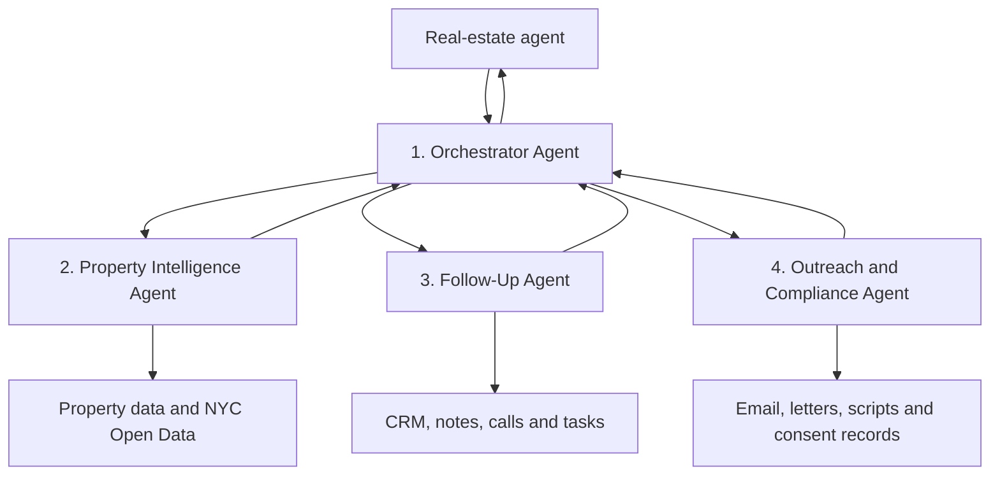

# Real Estate Property Intelligence App

## Four-Agent Orchestration Architecture

This application can use four coordinated AI agents. The recommended structure is one central orchestrator and three specialist agents. The specialist agents do not communicate freely with each other. Instead, the orchestrator assigns work, receives structured results, and prepares the final response for the user.



## 1. Orchestrator Agent

The Orchestrator Agent is the only agent that communicates directly with the user. It understands the request, decides which specialists are required, calls them in the correct order, combines their results, and returns one clear response.

Example user requests:

- "Who should I call today?"
- "What happened with 123 Main Street?"
- "Create my prospecting plan for Rosedale."
- "Draft a follow-up for Mrs. Smith."

Responsibilities:

- Understand the user's intent.
- Select the appropriate specialist agents.
- Coordinate the workflow.
- Combine structured specialist results.
- Enforce shared safety and compliance rules.
- Ask for approval before consequential actions.
- Present the final recommendation to the user.

The orchestrator should not perform detailed property research or write outreach itself. Its responsibility is coordination.

## 2. Property Intelligence Agent

The Property Intelligence Agent investigates properties and identifies useful opportunity signals.

Possible tools:

```text
get_property_by_address()
get_property_by_bbl()
get_property_events()
get_hpd_violations()
get_sales_history()
get_mortgage_history()
get_agent_leads()
```

Example structured output:

```json
{
  "propertyId": "queens-123-main-street",
  "signals": [
    {
      "type": "ownership_length",
      "value": "27 years",
      "source": "property_record"
    },
    {
      "type": "new_violation",
      "value": "Class C violation added 12 days ago",
      "source": "NYC HPD"
    }
  ],
  "recommendedPriority": "high",
  "explanation": "Long ownership period, recent property event and previous agent conversation."
}
```

The agent can interpret evidence, but application code should calculate the final opportunity score using transparent rules.

Example scoring rules:

```text
Overdue follow-up            +30
Recent property event        +20
Owner expressed interest     +40
Contact information missing  -15
Do-not-call restriction      Block outreach
```

This approach makes every recommendation explainable and testable.

## 3. Follow-Up Agent

The Follow-Up Agent understands conversations and manages relationship history.

Responsibilities:

- Summarize call transcripts.
- Extract seller motivation.
- Identify the expected selling timeline.
- Extract promises and next steps.
- Find forgotten or overdue follow-ups.
- Recommend the next contact date.
- Suggest CRM tasks.
- Identify leads that have gone cold.

Example conversation:

> "I'm not ready now. My daughter is graduating in June. Call me afterward."

Example structured result:

```json
{
  "motivation": "Possible sale after daughter's graduation",
  "timeline": "June 2027",
  "recommendedFollowUp": "2027-06-15",
  "sentiment": "open_but_not_ready",
  "nextAction": "Schedule follow-up call"
}
```

The agent proposes an action. A deterministic application tool, such as `create_follow_up_task()`, writes the approved task to the database.

## 4. Outreach and Compliance Agent

The Outreach and Compliance Agent prepares personalized communication using the property record and conversation history.

It can draft:

- Call scripts
- Follow-up emails
- Direct-mail letters
- Text messages
- Open-house follow-ups
- Neighborhood farming campaigns

Before preparing outreach, it should use deterministic compliance tools:

```text
check_do_not_call_status()
check_contact_consent()
check_existing_relationship()
check_channel_permission()
check_protected_attribute_usage()
```

Example output:

```json
{
  "channel": "direct_mail",
  "allowed": true,
  "message": "Hi Mrs. Smith, when we spoke last fall...",
  "approvalRequired": true,
  "complianceWarnings": []
}
```

This agent should never automatically call, text, email, or launch a campaign. The user must review and approve external communication.

## Example Orchestration Workflow

When the user asks, "Who should I call today?", the application follows this workflow:

1. Application code retrieves properties with new events or overdue follow-ups.
2. The Property Intelligence Agent analyzes the property signals.
3. The Follow-Up Agent analyzes previous conversations and commitments.
4. The Orchestrator Agent combines the results and creates a ranked list.
5. The Outreach Agent drafts scripts only for properties selected by the user.
6. The user approves before contact is initiated or a CRM record is changed.

Example response:

```text
1. 123 Main Street
   Reason: Follow-up is 14 days overdue and the owner previously mentioned selling.
   Suggested action: Call today.

2. 45 Farmers Boulevard
   Reason: New property violation and 22 years of ownership.
   Suggested action: Research contact information before outreach.

3. 98 Linden Boulevard
   Reason: Warm lead asked to reconnect after July 15.
   Suggested action: Send an approved follow-up email.
```

## Recommended Implementation Pattern

The recommended pattern is **agents as tools**. The Orchestrator Agent stays in control and calls the specialist agents as tools. This is preferable to handing the entire conversation to a specialist because the application needs one user-facing agent, one approval process, and consistent guardrails.

Simplified TypeScript example:

```typescript
import { Agent } from "@openai/agents";

const propertyAgent = new Agent({
  name: "Property Intelligence",
  instructions: `
    Analyze property records and return evidence-backed property signals.
    Never invent missing property information.
    Return structured data only.
  `,
});

const followUpAgent = new Agent({
  name: "Follow-Up",
  instructions: `
    Analyze CRM timelines, notes and transcripts.
    Extract motivation, timeline and recommended next action.
    Never create or modify tasks directly.
  `,
});

const outreachAgent = new Agent({
  name: "Outreach and Compliance",
  instructions: `
    Draft personalized outreach only after checking contact permissions.
    Never send messages or initiate calls.
    Require user approval for external actions.
  `,
});

const orchestrator = new Agent({
  name: "Real Estate Orchestrator",
  instructions: `
    Coordinate property intelligence, follow-up and outreach.
    Combine specialist results into one concise recommendation.
    Require user confirmation before consequential actions.
  `,
  tools: [
    propertyAgent.asTool({
      toolName: "analyze_property",
      toolDescription: "Analyze property records and opportunity signals",
    }),
    followUpAgent.asTool({
      toolName: "analyze_follow_up",
      toolDescription: "Analyze relationship history and next actions",
    }),
    outreachAgent.asTool({
      toolName: "prepare_outreach",
      toolDescription: "Check permissions and prepare personalized outreach",
    }),
  ],
});
```

## Important Design Rules

- Keep the database as the shared source of truth.
- Do not give each agent its own independent copy of property information.
- Pass property IDs and user IDs between agents instead of entire databases or conversation histories.
- Use structured JSON outputs between agents.
- Keep data retrieval, permission checks, scoring, and database writes deterministic.
- Require user approval before sending messages, scheduling calls, deleting data, spending money, or performing bulk updates.
- Set maximum limits for agent turns, tool calls, runtime, and cost.
- Record tool calls, recommendations, approvals, and failures for debugging.
- Exclude sensitive CRM and personal data from AI traces whenever possible.
- Run independent property and follow-up analysis in parallel where useful.
- Run outreach only after research and follow-up analysis are complete.

## Recommended MVP Order

Build the agents incrementally:

1. Property Intelligence Agent
2. Follow-Up Agent
3. Orchestrator Agent
4. Outreach and Compliance Agent

The first release should focus on producing a trustworthy daily property-priority list. The Outreach and Compliance Agent should be added only after the property research and follow-up workflows work reliably.

## References

- [OpenAI Agent Orchestration](https://openai.github.io/openai-agents-js/guides/multi-agent/)
- [OpenAI Agents as Tools](https://openai.github.io/openai-agents-js/guides/tools/)
- [OpenAI Agents SDK Tracing](https://openai.github.io/openai-agents-js/guides/tracing/)
