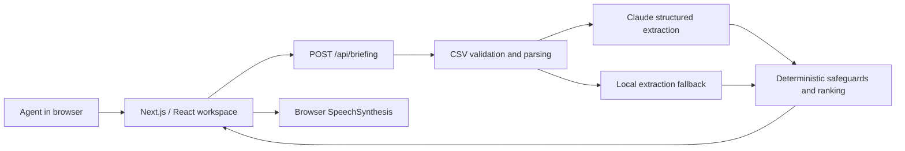
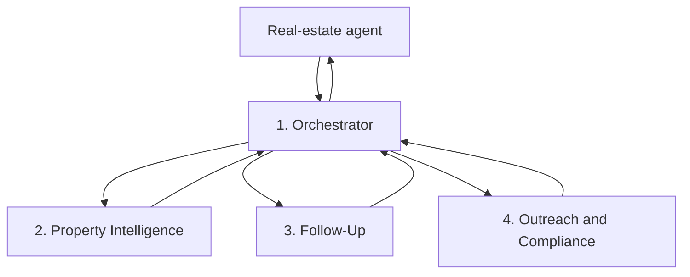

# Property OS — Canonical Project Memory

Last updated: July 20, 2026

This file preserves the product and engineering context accumulated during planning and implementation. It is the source of truth for teammates and future coding agents. Update it whenever a material decision changes.

## 1. Product identity

**Working name:** Property OS

**Category:** Property-centered real-estate workflow and intelligence platform.

**Core idea:** The property is the customer. Every address becomes its own workspace containing the owner, mortgage, taxes, violations, sales history, notes, call records, messages, documents, offers, timeline, tasks, and an evidence-backed AI summary.

**Positioning:** Property OS is not another generic CRM or chatbot. It combines property intelligence, relationship memory, daily prioritization, mapping, and workflow so an agent knows which property needs attention next and why.

**One-line promise:** Know which property needs you next.

## 2. Problems being solved

### Problem A — Agent workflow is fragmented

Real-estate agents switch among lead lists, CRMs, dialers, notes, email, texts, public-record sites, maps, and task tools while prospecting. Context for the same property is split among multiple systems. The result is repeated research, missed context, slower outreach, and less time spent in real conversations.

### Problem B — Follow-up commitments disappear inside messy notes

Agents record statements such as “call after Christmas,” “daughter graduates in June,” or “not selling—do not call” in inconsistent notes. When those notes are not converted into structured follow-ups, agents contact people at the wrong time, miss warm opportunities, or create compliance risk.

### Problem C — Property signals are data, not decisions

Ownership length, inherited-property events, mortgage age, violations, liens, absentee ownership, permits, listing history, and past conversations may indicate an opportunity. Agents still have to interpret those signals manually. Without prioritization, high-value opportunities can remain buried in a large list.

## 3. Target users

### Primary MVP user

An individual residential real-estate agent or small team that prospects existing homeowners and manages many property-centered relationships.

### Later users

- Real-estate investor or acquisition team
- Brokerage team leader
- Neighborhood farming specialist
- Small property-management or wholesaling team, subject to legal and compliance review

The current MVP is designed around a listing/prospecting agent, not an inbound pre-construction sales representative.

## 4. Chosen solution

Property OS creates a command center where every property has a persistent workspace and the system produces an explainable daily action plan.

The long-term product includes:

- Property workspaces
- Relationship timeline and memory
- Evidence-backed seller-opportunity scoring
- Daily call and follow-up queue
- Neighborhood intelligence
- Parcel map
- Human-approved scripts and outreach
- Audio morning briefing

### Absolute must-ship-first feature

The first P0 feature is:

> Upload a CSV containing messy property-lead notes and receive the top three properties to contact today, with evidence, confidence, and a recommended next action.

This feature delivers the product’s core value without requiring every future data integration. It proves that Property OS can turn scattered information into a trustworthy daily decision.

### MVP success moment

The demo lands when a user imports the provided messy CSV and immediately receives a useful priority queue while a do-not-contact record is deterministically excluded.

## 5. Creative future direction

The unconventional concept is a “Radio DJ for Real Estate”: a hands-free, personalized morning audio show that narrates the priority queue, pauses to offer an approved call, collects a spoken post-call note, updates the property timeline, and continues to the next property.

This is intentionally not the first MVP. The current app uses browser text-to-speech only. Streaming voice orchestration, speech-to-text, call bridging, and mid-call state management are future work.

## 6. Current implementation

The runnable application lives in `web/`.

### Implemented product views

- **Morning Briefing:** KPIs, top-priority properties, neighborhood pulse, tasks, CSV import, and audio playback.
- **Properties:** Search, signal/status filters, opportunity scores, and next actions.
- **Property Workspace:** Property facts, evidence-backed summary, active signals, timeline, session-local notes, and a simulated “mark called” action.
- **Map Intelligence:** A stylized demo parcel view and neighborhood opportunity panel.
- **Tasks:** Session-local task completion with explicit human-approval messaging.

### Important truth labels

- Most dashboard properties and metrics are demo content from `web/lib/demo-data.ts`.
- The map is a CSS demo visualization, not a live GIS map.
- Notes and task changes are client state and reset after a page reload.
- No database is connected yet.
- No call, text, email, letter, or campaign is sent.
- The $124K commission and $18.4M pipeline figures are illustrative demo values, not financial projections.

### Real working P0 path

1. The user uploads a CSV or chooses `web/public/messy-leads.csv`.
2. `POST /api/briefing` validates the request.
3. Claude Haiku 4.5 extracts structured fields when an Anthropic key is available.
4. The deterministic TypeScript layer validates dates and evidence, enforces do-not-contact rules, and ranks leads.
5. The UI displays the resulting evidence-backed priority queue and provider/run information.
6. Without a key or if Claude fails, a clearly labeled deterministic local fallback keeps the demo functional.

## 7. Current technical architecture



### Frontend and runtime

- Next.js 16 + React 19
- TypeScript
- Vinext/Vite for Cloudflare-compatible builds
- Tailwind package is installed, while the current custom interface is primarily styled in `web/app/globals.css`
- Sites hosting metadata in `web/.openai/hosting.json`

### AI and audio stack

- **Primary extraction model:** `claude-haiku-4-5`
- **Optional low-confidence fallback:** `claude-opus-4-8`
- **Opus fallback default:** disabled to protect cost and latency
- **Structured output:** JSON schema through the Anthropic SDK
- **Ranking and safeguards:** deterministic TypeScript
- **Audio output:** browser Web Speech API / `SpeechSynthesis`
- **Speech input:** not implemented

### Why this stack was chosen

The professor requested a concrete LLM and voice stack so the three-day build would have predictable latency and cost. Haiku handles extraction cheaply and quickly, deterministic code owns safety and scoring, and browser speech avoids a separate TTS bill for the MVP.

### Environment variables

Defined in `web/.env.example`:

```text
ANTHROPIC_API_KEY=
ANTHROPIC_MODEL=claude-haiku-4-5
ANTHROPIC_FALLBACK_MODEL=claude-opus-4-8
ANTHROPIC_ENABLE_OPUS_FALLBACK=false
NEXT_PUBLIC_APP_NAME=Property OS
```

Never commit real secret values. `.env` and `.env.local` must remain ignored.

## 8. Four-agent orchestration design

The future architecture uses one user-facing orchestrator and three specialists. Full details live in [`REAL_ESTATE_AGENT_ORCHESTRATION.md`](../REAL_ESTATE_AGENT_ORCHESTRATION.md).



### Agent responsibilities

1. **Orchestrator:** Understands intent, invokes specialists, combines results, applies shared policy, and asks for approval.
2. **Property Intelligence:** Interprets property records and returns source-backed signals. It does not own the final score.
3. **Follow-Up:** Extracts motivation, timing, promises, sentiment, and recommended follow-up from notes or transcripts.
4. **Outreach and Compliance:** Checks deterministic permission/compliance tools and drafts communication. It never sends autonomously.

### Orchestration rules

- Use agents as tools under one orchestrator.
- Share database records through IDs, not independent agent memory stores.
- Use structured JSON between agents.
- Let deterministic application code own permissions, scoring, compliance blocks, and writes.
- Require explicit approval for calls, texts, emails, letters, campaigns, scheduling, deletion, spending, and bulk changes.
- Log model calls, tools, evidence, approvals, latency, cost, and failures.
- Limit turns, tool calls, time, and spend.
- Run independent research and follow-up analysis in parallel when useful.
- Run outreach only after research and relationship analysis.

The current MVP does not yet run these four agents. It implements the reliable extraction, safeguard, and prioritization foundation they will use.

## 9. Data model direction

The central object is a property workspace.

```text
Property
  id / BBL / address
  owner relationships
  property facts
  opportunity signals
  timeline events
  notes and transcripts
  tasks and follow-ups
  contact permissions
  documents and media
  AI summaries
  scoring history
```

Future tables should likely include `properties`, `people`, `property_people`, `timeline_events`, `signals`, `tasks`, `contact_permissions`, `documents`, `model_runs`, and `approvals`. Do not collapse a property and owner into one record; ownership can change, and one person can relate to multiple properties.

## 10. Safety and compliance requirements

These are product requirements, not optional polish:

- Do-not-contact status must override model output and ranking.
- Missing or ambiguous evidence must lower confidence or trigger review.
- AI must not invent property facts or imply public-record verification that did not occur.
- Sensitive or protected attributes must never be seller-opportunity signals.
- Outreach requires channel permission and human approval.
- Recommendations must show why they were made and the evidence used.
- Store the minimum personal data necessary.
- Production use will require legal review of telemarketing, texting, email, fair-housing, privacy, data licensing, and record-retention obligations.

## 11. Test and evaluation assets

- `web/public/messy-leads.csv`: 20 intentionally messy lead notes for the demo.
- `web/data/messy-leads-expected.json`: human labels used to evaluate extraction.
- `web/tests/briefing.test.mjs`: CSV validation, ranking, and evidence behavior.
- `web/tests/extraction.test.mjs`: local benchmark, Claude structured-output path, cost metrics, and deterministic do-not-contact override.
- `web/tests/rendered-html.test.mjs`: production server-rendering smoke test.

Required verification:

```bash
cd web
npm run lint
npm test
```

At the July 20, 2026 checkpoint, lint passed and all eight automated tests passed.

## 12. Repository and deployment memory

- GitHub: `https://github.com/MITRAKER/PROPERTY-OS`
- Main frontend branch: `Frontend`
- Current frontend milestone commit: `4b11558` (`feat: build Property OS frontend workspace`)
- Private preview: `https://property-os-briefing.jackson1stamericanpr.chatgpt.site`
- Hosting project ID is stored in `web/.openai/hosting.json`; treat it as opaque.

Untracked research documents in the repository root may belong to the user. Do not stage, overwrite, move, or delete them unless explicitly requested.

## 13. File map

```text
AGENTS.md                              Future-agent working instructions
docs/PROJECT_MEMORY.md                 Canonical product and engineering memory
REAL_ESTATE_AGENT_ORCHESTRATION.md     Detailed four-agent architecture
README.md                              Project entry point and setup
web/app/page.tsx                       Current interactive product experience
web/app/globals.css                    Product visual system and responsive layout
web/app/api/briefing/route.ts          Server-side briefing endpoint
web/lib/briefing.ts                    CSV parsing, validation, ranking, explanations
web/lib/extraction.ts                  Claude/local extraction and metrics
web/lib/demo-data.ts                   Clearly demo-labeled workspace data
web/public/messy-leads.csv              Demo import fixture
web/data/messy-leads-expected.json     Human-labeled benchmark
web/tests/                             Automated verification
web/.env.example                       Safe environment-variable template
web/.openai/hosting.json               Sites deployment binding
```

## 14. What this product is not

- Not Zillow or an automated valuation model
- Not a generic AI chatbot
- Not only a dialer
- Not an autonomous outreach bot
- Not a live public-record database yet
- Not the same as an inbound AI sales agent for Colombian pre-construction projects

The classmate’s pre-construction agent focuses on qualifying and converting buyers for a developer’s inventory. Property OS focuses on property-centered intelligence, seller-opportunity prioritization, and relationship workflow for existing properties.

## 15. Roadmap

### P0 — Current MVP

- Import messy CSV leads
- Extract structured relationship signals
- Enforce deterministic do-not-contact protection
- Rank and explain the top three properties
- Play the morning briefing through browser audio
- Demonstrate the wider Property OS workspace

### P1 — Make the workspace persistent

- Add authentication and team/workspace boundaries
- Add a relational database
- Persist properties, relationships, notes, tasks, and timelines
- Replace simulated actions with audited application commands
- Add property deduplication and address normalization
- Add CSV import mapping and error correction UI

### P2 — Real property intelligence

- Integrate licensed/approved property and NYC public-record sources
- Store source provenance and refresh timestamps
- Add a transparent scoring engine with versioned weights
- Replace the stylized map with a real parcel/map provider
- Add saved neighborhoods and weekly intelligence summaries

### P3 — Orchestrated agents

- Property Intelligence Agent
- Follow-Up Agent
- Orchestrator Agent
- Outreach and Compliance Agent
- Approval inbox, trace review, budgets, retries, and failure handling

### P4 — Voice and workflow expansion

- Speech-to-text notes
- Interactive morning radio briefing
- Call/dialer integration with explicit approval
- Email, text, and direct-mail drafts with permission checks
- Calendar and CRM integrations

## 16. Decision log

- **Property-centered model selected:** the address is the stable workspace; people are relationships to it.
- **First value narrowed to prioritization:** build the evidence-backed morning queue before the full CRM.
- **Dialer reduced to a future feature:** it belongs inside the platform and is not the product itself.
- **Four-agent design selected:** one orchestrator plus three specialists, not a free-form agent swarm.
- **Deterministic safety selected:** the model cannot override do-not-contact or own consequential writes.
- **Haiku-first model strategy selected:** fast extraction first, optional Opus only for low confidence.
- **Browser TTS selected for MVP:** avoids premature voice infrastructure and cost.
- **Demo remains functional without a key:** use a labeled local fallback; never pretend it is Claude.
- **Human approval retained:** the MVP recommends and drafts but does not contact anyone autonomously.

## 17. Next-session checklist

Before implementing the next feature:

1. Read this memory and the orchestration document.
2. Confirm the current branch and preserve unrelated user files.
3. Run the current tests to establish a baseline.
4. State whether the requested feature is demo-only or production-backed.
5. Keep source provenance and human approval visible in the UI.
6. Update this memory if the work changes scope, stack, architecture, or product truth.
