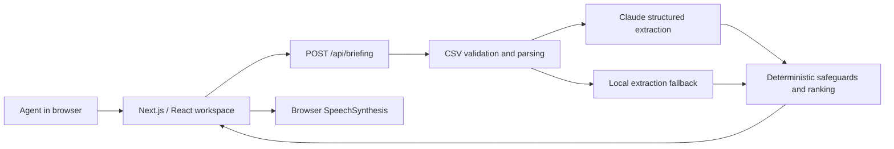
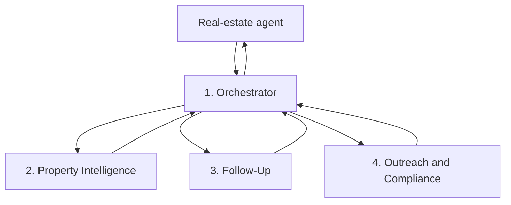

# Property OS — Canonical Project Memory

Last updated: July 20, 2026

This file preserves the product and engineering context accumulated during planning and implementation. It is the source of truth for teammates and future coding agents. Update it whenever a material decision changes.

## 1. Product identity

**Working name:** Property OS

**Category:** Property-centered real-estate workflow and intelligence platform.

**Core idea:** The property is the customer. Every address becomes its own workspace containing the owner, mortgage, taxes, violations, sales history, notes, call records, messages, documents, offers, timeline, tasks, and an evidence-backed AI summary.

**Positioning:** Property OS is not another generic CRM or chatbot. It combines property intelligence, relationship memory, daily prioritization, mapping, and workflow so an agent knows which property needs attention next and why.

**One-line promise:** Know which property needs you next.

## 2. Problems being solved

### Problem A — Agent workflow is fragmented

Real-estate agents switch among lead lists, CRMs, dialers, notes, email, texts, public-record sites, maps, and task tools while prospecting. Context for the same property is split among multiple systems. The result is repeated research, missed context, slower outreach, and less time spent in real conversations.

### Problem B — Follow-up commitments disappear inside messy notes

Agents record statements such as “call after Christmas,” “daughter graduates in June,” or “not selling—do not call” in inconsistent notes. When those notes are not converted into structured follow-ups, agents contact people at the wrong time, miss warm opportunities, or create compliance risk.

### Problem C — Property signals are data, not decisions

Ownership length, inherited-property events, mortgage age, violations, liens, absentee ownership, permits, listing history, and past conversations may indicate an opportunity. Agents still have to interpret those signals manually. Without prioritization, high-value opportunities can remain buried in a large list.

## 3. Target users

### Primary MVP user

An individual residential real-estate agent or small team that prospects existing homeowners and manages many property-centered relationships.

### Later users

- Real-estate investor or acquisition team
- Brokerage team leader
- Neighborhood farming specialist
- Small property-management or wholesaling team, subject to legal and compliance review

The current MVP is designed around a listing/prospecting agent, not an inbound pre-construction sales representative.

## 4. Chosen solution

Property OS creates a command center where every property has a persistent workspace and the system produces an explainable daily action plan.

The long-term product includes:

- Property workspaces
- Relationship timeline and memory
- Evidence-backed seller-opportunity scoring
- Daily call and follow-up queue
- Neighborhood intelligence
- Parcel map
- Human-approved scripts and outreach
- Audio morning briefing

### Absolute must-ship-first feature

The first P0 feature is:

> Upload a CSV containing messy property-lead notes and receive the top three properties to contact today, with evidence, confidence, and a recommended next action.

This feature delivers the product’s core value without requiring every future data integration. It proves that Property OS can turn scattered information into a trustworthy daily decision.

### MVP success moment

The demo lands when a user imports the provided messy CSV and immediately receives a useful priority queue while a do-not-contact record is deterministically excluded.

## 5. Creative future direction

The unconventional concept is a “Radio DJ for Real Estate”: a hands-free, personalized morning audio show that narrates the priority queue, pauses to offer an approved call, collects a spoken post-call note, updates the property timeline, and continues to the next property.

This is intentionally not the first MVP. The current app uses browser text-to-speech only. Streaming voice orchestration, speech-to-text, call bridging, and mid-call state management are future work.

## 6. Current implementation

The runnable application lives in `web/`.

### Implemented product views

- **Morning Briefing:** KPIs, top-priority properties, neighborhood pulse, tasks, CSV import, audio playback, an **Ask Property OS orchestrator command bar**, and an **agent-activity (model-run) panel**.
- **Properties:** Search, signal/status filters, opportunity scores, and next actions — now backed by the database.
- **Property Workspace:** Property facts (real BBL/assessed value/year built once enriched), evidence-backed summary, active signals, a **persisted timeline**, persisted notes, an audited “mark called” action, an **“Enrich from NYC records”** action that pulls and stores live public records, and an editable **contact-permissions** panel that drives the compliance gate.
- **Map Intelligence:** A **real Leaflet/OpenStreetMap tile map** with properties plotted at their true coordinates. **Click any block to prospect it** — Property OS pulls the real tax lots there from NYC PLUTO, scores them as leads with stated reasons, and "Add as lead" turns one into a real property workspace. The neighborhood panel is computed from the workspace, not hardcoded.
- **Lead flow ("who's next?"):** `GET /api/leads/next` returns the highest-value contactable property that still needs work, with the reason it was chosen (overdue follow-up → never contacted → highest score). Surfaced as a "Next lead →" action and a banner on the property workspace.
- **Tasks:** Persisted task completion, **task creation**, and **auto-generated follow-up tasks** from extracted follow-up dates; every change is audited.
- **Approvals:** The human-approval gate. Drafted outreach is held here as `pending` and a person approves or rejects it. Includes the recent audit log.
- **Contacts:** Owners/contacts as first-class records (`people` / `property_people`), each showing their related properties.
- **Settings:** Read-only runtime configuration (data provider, models, key-configured flag, scoring version) and account/identity. No secrets are shown.
- **Workspace deal room:** a transparent **score breakdown** (`web/lib/scoring.ts`, versioned), an **Offers** tracker, and a **Records & documents / sales-history** section fed by ACRIS/DOB during enrichment.
- **Global command palette** (⌘K), a **notifications** dropdown, **saved neighborhoods**, a **weekly intelligence** strip, a CSV **rejected-rows** notice, **voice input** for the orchestrator, and a live **user identity** (ChatGPT headers when present, "Local session" otherwise).

### Important truth labels

- The workspace is now backed by a **real Cloudflare D1 (SQLite) database via Drizzle ORM**. Locally it runs on miniflare and persists to `web/.wrangler/state`.
- **There is no demo/sample seeding.** A new workspace starts completely empty; real data only enters via CSV import or NYC enrichment. The app shows friendly empty states until then. (`web/lib/property-model.ts` holds shared types; its sample arrays are used only by tests, never by the app.)
- Notes, task toggles, “mark called”, imported properties, drafts, and approvals **persist across reloads and server restarts**.
- The map is a **real slippy map**: Leaflet with OpenStreetMap raster tiles (attribution required, no API key). Properties are plotted at their real latitude/longitude. **Clicking any block prospects that area for new leads** from live NYC PLUTO parcels.
- Property Intelligence has a **live NYC Open Data provider** (GeoSearch + PLUTO + HPD + DOB + ACRIS), used both by `/api/property/lookup` and by per-property **enrichment** (`/api/properties/enrich`), which persists BBL, assessed value, year built, coordinates, and public signals onto the property. Public records never supply phone, email, consent, or sale intent — those stay CRM-only and are surfaced as `missingInformation`.
- Neighborhood pulse figures are computed from the properties actually in the workspace (`web/lib/insights.ts`), not hardcoded.
- **Free notification channels (no paid service).** Desktop notifications via the browser's own Notification API fire for due follow-ups and pending approvals. Follow-ups export as `.ics` calendar events with alarms (`GET /api/calendar`), so the agent's own calendar reminds them even when Property OS is closed. Approved drafts render as print-ready letters (`GET /api/outreach/letter?approvalId=`) — the mailing address is free from public records, making direct mail the zero-cost way to reach a prospected owner. Paid SMS (Twilio) remains optional and unconfigured by default.
- **Outreach delivery is real but human-triggered.** Approving a draft with a recipient actually sends it — email via Resend, SMS via Twilio. Nothing sends autonomously: a person must approve, and the compliance gate (do-not-contact + channel permission) is **re-checked at send time**, so a property flagged do-not-contact after drafting is still blocked. Voice calls are deliberately never auto-placed (TCPA); the approved script is handed to a person to dial. Direct mail is produced offline.

### Real working P0 path (now persistent + orchestrated)

1. The user uploads a CSV or chooses `web/public/messy-leads.csv`.
2. `POST /api/briefing` validates the request and runs the **Follow-Up Agent** (Claude Haiku 4.5 when a key is present, deterministic local model otherwise).
3. The deterministic TypeScript layer validates dates and evidence, enforces do-not-contact rules, and ranks leads.
4. Imported leads are **persisted as real property workspaces** (upserted by address), the model run is logged, and the UI shows the evidence-backed priority queue.
5. The **Orchestrator** (`POST /api/orchestrator`) answers agent questions ("who should I call today?", "what happened with X?", "draft an email for Y"), calling the Property Intelligence and Outreach & Compliance agents as tools. Drafted outreach is stored as a pending approval; nothing is sent.
6. Without a key or if Claude fails, a clearly labeled deterministic local fallback keeps every agent functional.

## 7. Current technical architecture



### Frontend and runtime

- Next.js 16 + React 19
- TypeScript
- Vinext/Vite for Cloudflare-compatible builds
- Tailwind package is installed, while the current custom interface is primarily styled in `web/app/globals.css`
- Sites hosting metadata in `web/.openai/hosting.json` (the `d1` field is now set to `"DB"` to bind the database)

### Authentication & multi-tenancy

- **Sign-in:** Google OAuth 2.0 authorization-code flow (`web/lib/auth/google.ts`, routes under `web/app/api/auth/`). Sessions are stateless, signed cookies (HMAC-SHA256, `web/lib/auth/session.ts`) using `SESSION_SECRET`.
- **Dev fallback:** when `GOOGLE_CLIENT_ID` is unset, the app auto-provisions a "Local Developer" user + "Local workspace" so local development needs no login. `/api/me` reports `needsLogin` so the frontend shows a Google sign-in screen only in production.
- **Multi-tenancy:** `users`, `workspaces`, `workspace_members` tables; every data table carries `workspace_id`. A request's identity + workspace is put in an `AsyncLocalStorage` context (`web/lib/auth/context.ts`) by the `withAuth` gate, and `web/db/repo.ts` scopes **every** query to `currentWorkspaceId()`. Seeded/imported ids are namespaced per workspace (`<workspaceId>::<id>`) so tenants never collide. Cross-workspace isolation is verified.
- Every data API route is wrapped in `withAuth`; unauthenticated requests get 401 in production (dev fallback locally). `/api/config` is the only unauthenticated data-adjacent route (non-secret runtime flags only).

### Persistence

- **Cloudflare D1 (SQLite)** accessed through **Drizzle ORM** (`web/db/schema.ts`, `web/db/repo.ts`).
- The binding is reached via `import { env } from "cloudflare:workers"` (`web/db/index.ts`), loaded through a dynamic import so non-worker tooling (the Node server-render test) can still load the bundle.
- Tables: `properties`, `people`, `property_people`, `signals`, `timeline_events`, `tasks`, `contact_permissions`, `model_runs`, `approvals`, `audit_log`.
- Locally there is no migration runner, so `repo.ts` creates tables with idempotent `CREATE TABLE IF NOT EXISTS` and `ALTER TABLE` on first use. No demo/sample data is ever seeded — workspaces start empty. `drizzle-kit generate` still produces migrations for the deploy path.
- API routes are the only DB consumers; agent logic is pure and DB-free so it stays unit-testable.

### Property data ingestion (swappable provider)

The Property Intelligence Agent analyzes a normalized `PropertyContext` (`web/lib/agents/property-context.ts`). A **data provider** produces that context; the agent never fetches or scrapes. The source can be swapped without changing the agent.

- `web/lib/data/workspace-provider.ts` — default provider. Turns the workspace's own property record into a `PropertyContext` (facts + `crmTimeline` + `publicSignals` from the property's notes). Provenance `workspace`.
- `web/lib/contacts/` — **owner contact data**. `ContactDataProvider` is a vendor-agnostic seam for paid skip tracing; the default reports `not_configured` honestly rather than faking results. Adding a vendor means implementing one interface — storage, permissions, compliance and UI already work off `ContactRecord`. The cheapest path needs no vendor integration at all: `GET /api/contacts/export` emits a vendor-neutral CSV of only high-scoring, contactable properties that have **no contact details yet** (so the same record is never paid for twice), and `POST /api/contacts/import` files whatever comes back, matching on `property_id` then address. Every imported number lands under the existing do-not-contact gate. Marketing use of this data is generally fine; tenant screening or credit decisions would trigger FCRA, which these vendors are not sold for.
- `web/lib/data/owner-mailing.ts` — **absentee-owner detection**. Public records never give a phone, but they do give the address the owner receives mail at (HPD Registration Contacts, falling back to DOB job filings). When that differs from the property address the owner does not live there — surfaced as an `absentee_owner` signal with the mailing address, owner name and source, and flagged specifically when out-of-state. Verified live: 2361 Broadway → owner mails to 99 Park Avenue.
- `web/lib/data/nyc-provider.ts` — live provider using all six official sources: GeoSearch (address → BBL/BIN/coords), then PLUTO (facts), HPD violations, DOB permit issuance, and ACRIS (two-step: property-document legals `8h5j-fqxa` → document master `bnx9-e6tj` for deeds/mortgages/transfers) run in parallel. Each fact is tagged with its source and retrieval time; a failed source degrades to `*_unavailable` in `missingInformation` rather than failing the whole lookup. Provenance `nyc_open_data`.
- `web/lib/data/provider.ts` — `createPropertyDataProvider(source)` chooses workspace (default) or nyc; controlled by `PROPERTY_DATA_PROVIDER` env or a per-request `?source=` param.
- `GET /api/property/lookup?address=...&source=workspace|nyc` runs ingestion → agent → evidence-backed report.

**Hard boundary (product requirement):** public records can supply property facts, deeds, mortgages, permits, violations, and the owner's **mailing address**. They cannot supply phone numbers, emails, contact permission, verified sale intent, or private call/message history. This was verified empirically on 2026-07-21 — neither HPD Registration Contacts nor DOB job filings expose any phone field (checked against each dataset's own column metadata). Do not chase folklore claiming otherwise, and never scrape people-search sites as a substitute. Those come only from the CRM or authorized integrations and are always returned in `missingInformation`. "Seller probability" stays an explainable prediction, never a public-record fact. Agents call official APIs through the ingestion layer only — never scrape arbitrary sites.

### AI and audio stack

- **Primary extraction model:** `claude-haiku-4-5`
- **Optional low-confidence fallback:** `claude-opus-4-8`
- **Opus fallback default:** disabled to protect cost and latency
- **Structured output:** JSON schema through the Anthropic SDK
- **Ranking and safeguards:** deterministic TypeScript
- **Audio output:** browser Web Speech API / `SpeechSynthesis`
- **Speech input:** not implemented

### Why this stack was chosen

The professor requested a concrete LLM and voice stack so the three-day build would have predictable latency and cost. Haiku handles extraction cheaply and quickly, deterministic code owns safety and scoring, and browser speech avoids a separate TTS bill for the MVP.

### Environment variables

Defined in `web/.env.example`:

```text
ANTHROPIC_API_KEY=
ANTHROPIC_MODEL=claude-haiku-4-5
ANTHROPIC_FALLBACK_MODEL=claude-opus-4-8
ANTHROPIC_ENABLE_OPUS_FALLBACK=false
NEXT_PUBLIC_APP_NAME=Property OS
PROPERTY_DATA_PROVIDER=workspace
GOOGLE_CLIENT_ID=
GOOGLE_CLIENT_SECRET=
SESSION_SECRET=
```

Auth is optional locally: with `GOOGLE_CLIENT_ID` unset the app runs as the dev-fallback user. In production set `GOOGLE_CLIENT_ID`, `GOOGLE_CLIENT_SECRET`, and a strong `SESSION_SECRET`, and configure the Google OAuth redirect URI `https://<domain>/api/auth/callback`.

Never commit real secret values. `.env` and `.env.local` must remain ignored.

## 8. Four-agent orchestration design

The future architecture uses one user-facing orchestrator and three specialists. Full details live in [`REAL_ESTATE_AGENT_ORCHESTRATION.md`](../REAL_ESTATE_AGENT_ORCHESTRATION.md).



### Agent responsibilities

1. **Orchestrator:** Understands intent, invokes specialists, combines results, applies shared policy, and asks for approval.
2. **Property Intelligence:** Interprets property records and returns source-backed signals. It does not own the final score.
3. **Follow-Up:** Extracts motivation, timing, promises, sentiment, and recommended follow-up from notes or transcripts.
4. **Outreach and Compliance:** Checks deterministic permission/compliance tools and drafts communication. It never sends autonomously.

### Orchestration rules

- Use agents as tools under one orchestrator.
- Share database records through IDs, not independent agent memory stores.
- Use structured JSON between agents.
- Let deterministic application code own permissions, scoring, compliance blocks, and writes.
- Require explicit approval for calls, texts, emails, letters, campaigns, scheduling, deletion, spending, and bulk changes.
- Log model calls, tools, evidence, approvals, latency, cost, and failures.
- Limit turns, tool calls, time, and spend.
- Run independent research and follow-up analysis in parallel when useful.
- Run outreach only after research and relationship analysis.

**Status (implemented):** All four roles now run in `web/lib/agents/`:

- `orchestrator.ts` — deterministic intent routing, coordinates specialists as tools, ranks, and gates approval. It is the only user-facing agent (the "Ask Property OS" bar and `POST /api/orchestrator`).
- `follow-up.ts` — wraps the Claude/local extraction, adds sentiment and recommended follow-up.
- `property-intelligence.ts` — interprets property records into source-backed signals + priority (deterministic ranking still owns the final score). Its `analyzePropertyContext()` reads a normalized `PropertyContext` from a data provider and never fetches, scrapes, or invents — every signal cites its evidence and source.
- `outreach-compliance.ts` + `compliance.ts` — runs deterministic compliance tools (do-not-contact, channel permission, protected-attribute, existing-relationship) first, drafts only when allowed, and never sends. Every draft is stored as a `pending` approval.

Each agent has a deterministic local fallback so the product works with no Anthropic key. Every agent/model call is logged to `model_runs`; every consequential write is logged to `audit_log`. This is the MVP version of the design; live public-record tools and the parallel research/outreach sequencing remain future work.

## 9. Data model direction

The central object is a property workspace.

```text
Property
  id / BBL / address
  owner relationships
  property facts
  opportunity signals
  timeline events
  notes and transcripts
  tasks and follow-ups
  contact permissions
  documents and media
  AI summaries
  scoring history
```

Future tables should likely include `properties`, `people`, `property_people`, `timeline_events`, `signals`, `tasks`, `contact_permissions`, `documents`, `model_runs`, and `approvals`. Do not collapse a property and owner into one record; ownership can change, and one person can relate to multiple properties.

## 10. Safety and compliance requirements

These are product requirements, not optional polish:

- Do-not-contact status must override model output and ranking.
- Missing or ambiguous evidence must lower confidence or trigger review.
- AI must not invent property facts or imply public-record verification that did not occur.
- Sensitive or protected attributes must never be seller-opportunity signals.
- Outreach requires channel permission and human approval.
- Recommendations must show why they were made and the evidence used.
- Store the minimum personal data necessary.
- Production use will require legal review of telemarketing, texting, email, fair-housing, privacy, data licensing, and record-retention obligations.

## 11. Test and evaluation assets

- `web/tests/fixtures/messy-leads.csv`: 20 intentionally messy lead notes, used only as a test benchmark (not served or seeded).
- `web/data/messy-leads-expected.json`: human labels used to evaluate extraction.
- `web/tests/briefing.test.mjs`: CSV validation, ranking, and evidence behavior.
- `web/tests/extraction.test.mjs`: local benchmark, Claude structured-output path, cost metrics, and deterministic do-not-contact override.
- `web/tests/agents.test.mjs`: orchestrator intent routing, compliance tools (do-not-contact / channel / protected-attribute blocks), orchestrator ranking without sending, outreach held for approval, do-not-contact block, and the property-intelligence / follow-up local fallbacks.
- `web/tests/rendered-html.test.mjs`: production server-rendering smoke test.

Required verification:

```bash
cd web
npm run lint
npm test
```

At the July 20, 2026 checkpoint (after the persistence + four-agent milestone), lint passed and all automated tests passed: 14 unit tests plus the production build and server-render smoke test. Persistence, the orchestrator, the compliance gate, and approvals were verified end-to-end against the running app (including survival across a server restart).

## 12. Repository and deployment memory

- GitHub: `https://github.com/MITRAKER/PROPERTY-OS`
- Main frontend branch: `Frontend`
- Current frontend milestone commit: `4b11558` (`feat: build Property OS frontend workspace`)
- Private preview: `https://property-os-briefing.jackson1stamericanpr.chatgpt.site`
- Hosting project ID is stored in `web/.openai/hosting.json`; treat it as opaque.

Untracked research documents in the repository root may belong to the user. Do not stage, overwrite, move, or delete them unless explicitly requested.

## 13. File map

```text
AGENTS.md                              Future-agent working instructions
docs/PROJECT_MEMORY.md                 Canonical product and engineering memory
REAL_ESTATE_AGENT_ORCHESTRATION.md     Detailed four-agent architecture
README.md                              Project entry point and setup
web/app/page.tsx                       Interactive product experience (DB-backed, orchestrator bar, approvals)
web/app/globals.css                    Product visual system and responsive layout
web/app/api/briefing/route.ts          Import -> Follow-Up Agent -> rank -> persist
web/app/api/orchestrator/route.ts      User-facing orchestrator endpoint
web/app/api/property/lookup/route.ts   Address -> data provider -> agent (workspace|nyc)
web/app/api/properties/                List(+permission), note, mark-called, enrich, permission
web/app/api/tasks/                     List + create + toggle endpoints
web/lib/insights.ts                    Computed neighborhood stats + map coordinate projection
web/app/PropertyMap.tsx                Leaflet/OSM tile map with click-to-prospect
web/lib/data/prospecting.ts            PLUTO proximity search + transparent lead scoring
web/app/api/leads/                     prospect / claim / next-lead endpoints
web/lib/outreach/delivery.ts           Real email (Resend) + SMS (Twilio) delivery
web/lib/outreach/letter.ts             Print-ready direct-mail letter (free channel)
web/lib/calendar/ics.ts                RFC 5545 calendar export for follow-ups
web/app/api/calendar/                  .ics feed so the agent's calendar reminds them
web/lib/scoring.ts                     Transparent versioned opportunity scoring (explainScore)
web/app/api/documents/ offers/ people/ Deal-room + contacts endpoints
web/app/api/saved-views/ me/ config/   Saved neighborhoods, identity, runtime config
web/app/api/approvals/                 List + decide (human approval gate)
web/app/api/trace/route.ts             Model runs + audit log (observability)
web/lib/auth/                          Google OAuth, signed sessions, workspace context, gate
web/app/api/auth/                      login / callback / logout routes
web/db/schema.ts                       Drizzle schema (users/workspaces + workspace-scoped data)
web/db/repo.ts                         Persistence, seeding, audit logging (worker-only)
web/db/index.ts                        D1 binding accessor (dynamic cloudflare:workers import)
web/lib/agents/orchestrator.ts         Orchestrator (intent routing, ranking, approval gate)
web/lib/agents/follow-up.ts            Follow-Up Agent (motivation, timing, sentiment)
web/lib/agents/property-intelligence.ts Property Intelligence Agent (signals, priority)
web/lib/agents/outreach-compliance.ts  Outreach & Compliance Agent (drafts, never sends)
web/lib/agents/compliance.ts           Deterministic compliance tools
web/lib/agents/property-context.ts     PropertyContext + PropertyDataProvider contract
web/lib/agents/anthropic.ts            Shared Claude structured-output helper
web/lib/data/workspace-provider.ts     Workspace records -> PropertyContext (default source)
web/lib/data/nyc-provider.ts           Live NYC GeoSearch + PLUTO + HPD provider
web/lib/data/provider.ts               createPropertyDataProvider(source) factory
web/lib/briefing.ts                    CSV parsing, validation, ranking, import mapping
web/lib/extraction.ts                  Claude/local extraction and metrics
web/lib/property-model.ts              Shared property/task types (sample arrays are test-only)
web/public/messy-leads.csv              Demo import fixture
web/data/messy-leads-expected.json     Human-labeled benchmark
web/tests/                             Automated verification (briefing, extraction, agents, render)
web/.env.example                       Safe environment-variable template
web/.openai/hosting.json               Sites deployment binding (d1 = "DB")
```

## 14. What this product is not

- Not Zillow or an automated valuation model
- Not a generic AI chatbot
- Not only a dialer
- Not an autonomous outreach bot
- Not a live public-record database yet
- Not the same as an inbound AI sales agent for Colombian pre-construction projects

The classmate’s pre-construction agent focuses on qualifying and converting buyers for a developer’s inventory. Property OS focuses on property-centered intelligence, seller-opportunity prioritization, and relationship workflow for existing properties.

## 15. Roadmap

### P0 — Current MVP

- Import messy CSV leads
- Extract structured relationship signals
- Enforce deterministic do-not-contact protection
- Rank and explain the top three properties
- Play the morning briefing through browser audio
- Demonstrate the wider Property OS workspace

### P1 — Make the workspace persistent (largely shipped)

- Add authentication and team/workspace boundaries — **done: Google OAuth sign-in + signed session cookies, and full multi-tenant workspace isolation (every table carries `workspace_id`, every query is scoped, ids are namespaced per workspace). A local dev fallback user runs when Google is unconfigured.**
- Add a relational database — **done (Cloudflare D1 + Drizzle)**
- Persist properties, relationships, notes, tasks, and timelines — **done**
- Replace simulated actions with audited application commands — **done (`audit_log` + `mark_called`, task toggles, notes, approvals)**
- Add property deduplication and address normalization — **partial (import upserts by address; normalization still basic)**
- Add CSV import mapping and error correction UI — **partial: rejected rows are surfaced after import; column remapping is still open**

### P2 — Real property intelligence (started)

- Integrate licensed/approved property and NYC public-record sources — **live: GeoSearch + PLUTO + HPD + DOB permits + ACRIS (deeds/mortgages/transfers)**
- Store source provenance and refresh timestamps — **done (every fact carries a source + retrievedAt)**
- Add a transparent scoring engine with versioned weights — **done (`web/lib/scoring.ts`, `explainScore`, version `v1`, shown as a per-property breakdown)**
- Replace the stylized map with a real parcel/map provider — **done: Leaflet + OpenStreetMap tiles, with click-to-prospect lead generation from live PLUTO parcels**
- Per-property enrichment persists real BBL/facts/coordinates/public signals — **done (`/api/properties/enrich`)**
- Add saved neighborhoods and weekly intelligence summaries — **done (saved views on the Properties page + a weekly intelligence strip on the briefing)**

### P3 — Orchestrated agents (MVP shipped)

- Property Intelligence Agent — **done (MVP; interprets held records, not live public data)**
- Follow-Up Agent — **done**
- Orchestrator Agent — **done (deterministic intent routing)**
- Outreach and Compliance Agent — **done (compliance gate + drafts, never sends)**
- Approval inbox and trace review — **done (`Approvals` view + agent-activity panel + audit log)**
- Budgets, retries, failure handling, live property-data tools, and LLM-planned routing — **still open**

### P4 — Voice and workflow expansion

- Speech-to-text notes
- Interactive morning radio briefing
- Call/dialer integration with explicit approval
- Email, text, and direct-mail drafts with permission checks
- Calendar and CRM integrations

## 16. Decision log

- **Property-centered model selected:** the address is the stable workspace; people are relationships to it.
- **First value narrowed to prioritization:** build the evidence-backed morning queue before the full CRM.
- **Dialer reduced to a future feature:** it belongs inside the platform and is not the product itself.
- **Four-agent design selected:** one orchestrator plus three specialists, not a free-form agent swarm.
- **Deterministic safety selected:** the model cannot override do-not-contact or own consequential writes.
- **Haiku-first model strategy selected:** fast extraction first, optional Opus only for low confidence.
- **Browser TTS selected for MVP:** avoids premature voice infrastructure and cost.
- **Demo remains functional without a key:** use a labeled local fallback; never pretend it is Claude.
- **Human approval retained:** the MVP recommends and drafts but does not contact anyone autonomously.
- **Persistence on D1 selected:** the app is a Cloudflare Workers app, so Cloudflare D1 (SQLite) via Drizzle is the natural store that works both locally (miniflare) and in production; no separate database service was added.
- **Local schema bootstrap selected:** because miniflare has no migration runner, tables are created idempotently on first use, so the product runs on a fresh machine with no manual migration step. No demo/sample data is seeded — a new workspace starts empty.
- **Agents kept pure and DB-free:** specialist agents receive plain data and an optional client and return structured JSON; only API routes touch the database, which keeps the agents unit-testable and enforces "deterministic code owns writes."
- **Orchestrator routing kept deterministic:** intent is classified by rules, not an LLM, so routing is predictable and testable; the LLM is used inside the specialist agents.
- **Compliance as a hard gate:** do-not-contact, channel permission, and protected-attribute checks are deterministic and block drafting; the model cannot override them.
- **Data ingestion separated from the agent:** the Property Intelligence Agent reads a normalized `PropertyContext` from a swappable `PropertyDataProvider`; a workspace provider (the caller's own records) is the default and a live NYC-Open-Data provider (all six sources) is opt-in. The source can change without rewriting the agent, and the agent never fetches or scrapes.
- **Public records never supply contact data:** phone, email, contact permission, and verified sale intent are structurally CRM-only and always returned as `missingInformation`; seller probability stays an explainable prediction, not a public-record fact.
- **Delivery is real but never autonomous:** outreach genuinely sends (Resend/Twilio), but only after a human approves, and the compliance gate re-runs at send time. Automated voice dialing is deliberately not implemented — it is the most regulated channel (TCPA / do-not-call) and a person places the call.
- **Map-click prospecting selected as the "next lead" engine:** rather than buying lead lists, an agent clicks a block and Property OS ranks the real parcels there from public records, with the reason for every point. Contact details still have to come from the CRM or an authorized provider.
- **Google OAuth + workspace tenancy selected:** the product is intended to be a real, deployed SaaS holding real agents' private CRM data, so sign-in (Google) and per-workspace data isolation are required, not optional. Chosen over ChatGPT-platform auth to keep it deployable as a standalone app.
- **Repository owns tenant scoping:** every query is scoped by an `AsyncLocalStorage` workspace context rather than trusting callers, so a missed filter can't silently leak another tenant's data.

## 17. Next-session checklist

Before implementing the next feature:

1. Read this memory and the orchestration document.
2. Confirm the current branch and preserve unrelated user files.
3. Run the current tests to establish a baseline.
4. State whether the requested feature is demo-only or production-backed.
5. Keep source provenance and human approval visible in the UI.
6. Update this memory if the work changes scope, stack, architecture, or product truth.

## 18. Recent updates (deploy, compliance, contact data, UI)

- **Deployed live** on Cloudflare Workers + D1 at
  https://property-os-morning-briefing.property-os.workers.dev. The build sources
  the D1 database id/name from env (`D1_DATABASE_ID` / `D1_DATABASE_NAME`) so
  `vinext build` emits a deploy-ready `dist/server/wrangler.json`; deploy from
  `web/` (the plugin writes `.wrangler/deploy/config.json`). See `web/DEPLOY.md`.
  Runs as the auto "Local Developer" workspace (Google OAuth left off).
- **Command-center home dashboard:** the briefing view surfaces every module at
  once — priority queue, neighborhood pulse, reminders, messages (approvals),
  people (owners), an embedded live map, and recent activity — rather than hiding
  them behind nav tabs. UI is a warm "amber glass" theme tuned for WCAG AA text
  contrast (min ~8.7:1).
- **Contact data (skip tracing) implemented:** vendor-agnostic
  `ContactDataProvider` is now real — a generic HTTP adapter that deep-scans any
  JSON response, plus a BatchData preset, configured entirely by env.
  `/api/contacts/lookup` goes live the moment a vendor key is set and degrades
  honestly to the CSV path otherwise.
- **Send-time compliance controls:** cold SMS off by default
  (`DEFAULT_PERMISSION.textAllowed=false`), 8am–9pm quiet hours for calls/texts,
  a workspace-wide do-not-contact suppression list (`suppressions` table +
  `/api/suppressions`), and a CAN-SPAM email footer. Deterministic, enforced in
  the send-time gate (`web/app/api/approvals/decide/route.ts`).
- **Legal posture:** a compliance review (TCPA/DNC/CAN-SPAM/FCRA/NY) was run; the
  controls above are built, but real-outreach go-live still gates on a signed
  vendor data contract, National DNC registration, and an attorney consult —
  which a local/demo build does not need.
- **Test count:** 64 unit tests + production build + server-render, all green.
